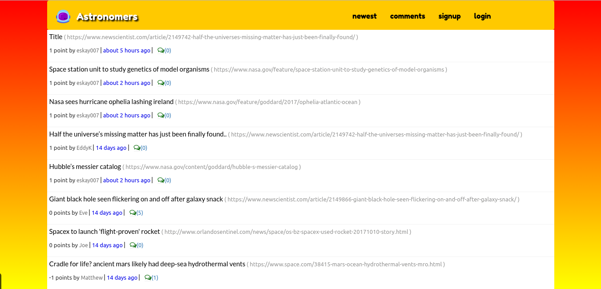
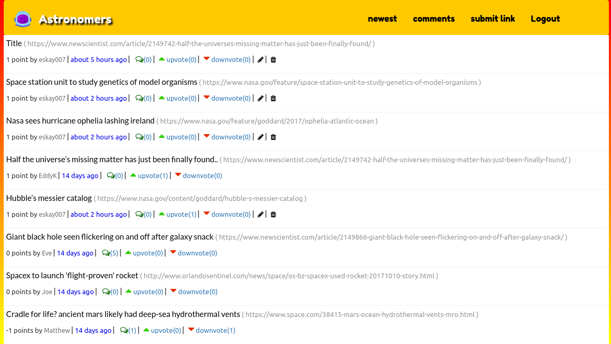
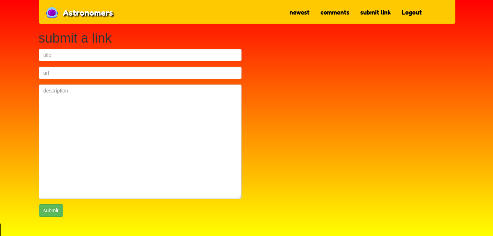
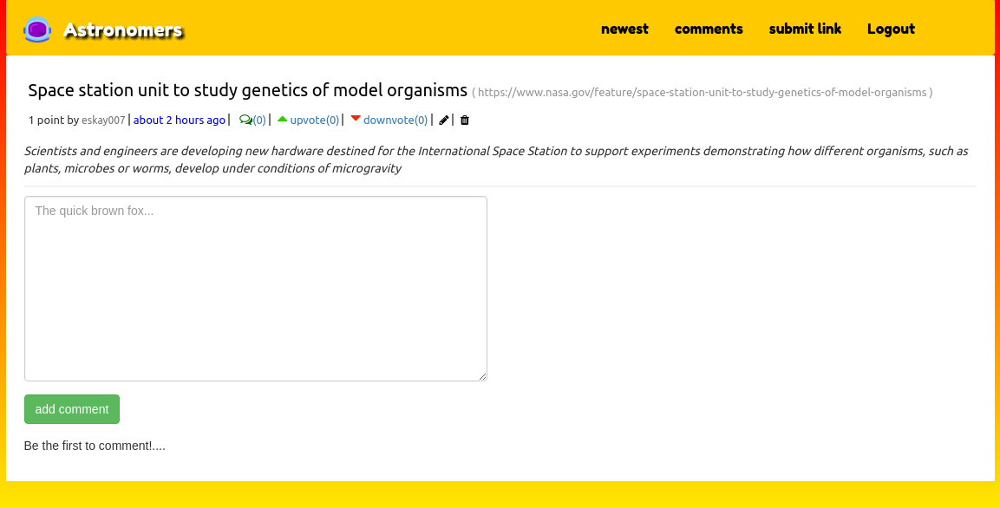
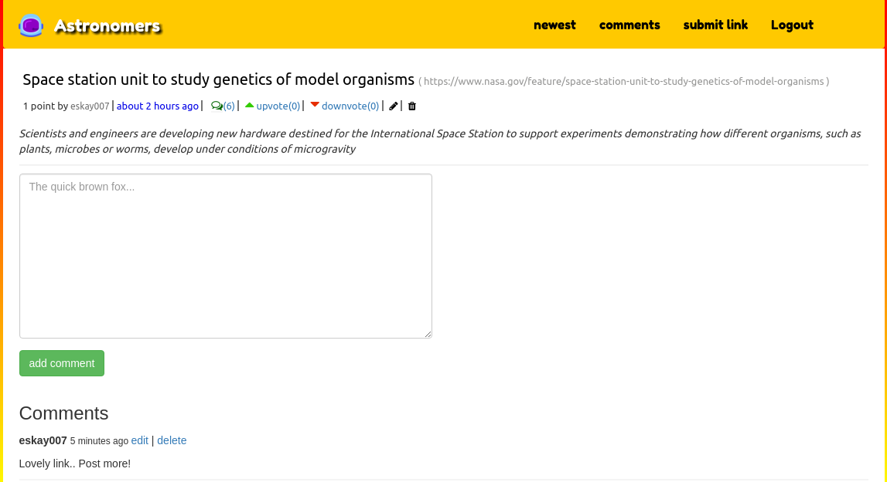

# Astronomers 

A web application for space nerds to share links to interesting space related articles out there as well as interact with their fellow nerds.

The live demo can be viewed [here](http://astronomers.herokuapp.com).

## How to use

The site homepage features recent links posted by users and are sorted via popularity.



An unregistered user cannot post a link, neither can he upvote, downvote or comment on a link. He can however see the number of comments, upvotes and downvotes a link has.

After signup/login however, these abilities are granted to the user.



The user can add links after clicking the add link button and upon submitting, the link will be added in the index page.



The user can click on the comments icon to view more about the link as well as comments.



The user can comment on given link.



The user can also click on newest to list out links via posted time.

Enjoy! :smile:

## Technologies

#### Front-end

* Bootstrap framework.
* CSS3.
* HTML 5.
* Google Fonts.
* Font Awesome Icons.

#### Back-end
* Ruby On Rails.
* PostgreSQL database.
* WebBrick web server.
* Active Record.

### Popularity Algorithm
The posted links are sorted depending on popularity( the hot score) and time.
This is to ensure links posted long ago, no matter how popular, do not occupy the front page.

##### the hot score

* The difference between the upvotes and downvotes is obtained ```points = upvotes - downvotes```

* Time when the link was posted is obtained via the created_at method and formatted to a number ```posted_time = ((Time.now - created_at) / 3600).round ```

* The link score is then calculated using the hot score formula that takes two values, the __points__ and the __posted_time__ ```score = hot_score(points, posted_time)```

* Calculating the hot score

```
def hot_score(points, posted_time, gravity = 1.8)
  (points - 1) / (posted_time + 2) ** gravity
end
```


On creating a link, the link is assigned a value of 1 point hence the minus above.
The gravity value can be anything, depending on how fast you want the link popularity to decline.

## Make it your own

Ensure you have the following installed before proceeding.

* PostgreSQL.
* Ruby.
* Bundler.
* Rails.
* Git.

Once you have installed these do the following:

* Clone this repository by clickin the clone/download button.

* Navigate to the directory via your terminal. Something like ```cd /downloads/astronomers/```

* Type __bundle__ in your terminal and press enter to install gems.
> If gem conflicts, navigate to the app folder and delete the __Gemfile.lock__ file and then run __bundle__ again.
* Once bundling is complete, run the command __rails db:create && rails db:migrate__ to create the database and migrate the different tables.

* Run the comand __rails s__ to start the rails server.

* Navigate to [https://localhost:3000](https://localhost:3000)

* To deploy, you can look up this link for details. [Heroku Deployment](http://curriculum.railsbridge.org/intro-to-rails/deploying_to_heroku)

Happy Coding!

## Author

[Kinuthia Samwel](http://kinuthia.herokuapp.com)

## Known Bugs

None

## License

The contents of this repository are bounded by the Apache License Version 2.0,

[](http://forthebadge.com)

&copy; __2017__
